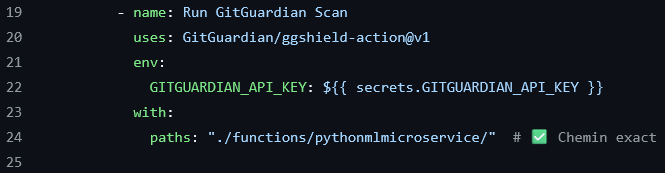
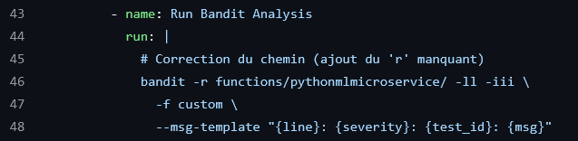
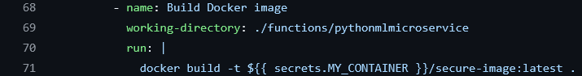
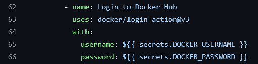

# Secure serverless function

The pipeline we have implemented provides an initial layer of security at the design stage of serverless functions. This process automates the creation of Docker images, which are then used by a serverless function manager for deployment.
At this stage, a security check is performed to detect potential vulnerabilities in the source code of the functions, particularly those developed in Python.

##  Instructions d'utilisation ou de test du projet

Pour utiliser ou tester ce projet, procédez ainsi :

### ✅ Étape 1 : Nouveau dépôt
- Créez-vous un nouveau repository sur GitHub.

### ✅ Étape 2 : Fonctions Python
- Placez vos fonctions Python dans un dossier du repository créé.

### ✅ Étape 3 : Workflow GitHub Actions
- Créez le dossier `.github/workflows/` dans votre repository.
- Créez un fichier `workflow_name.yml` à l'intérieur.

### ✅ Étape 4 : Télécharger le workflow
- Téléchargez le fichier via :

```bash
wget https://raw.githubusercontent.com/ridgit/create_secure_image/refs/heads/main/.github/workflows/pworkflow.yml
```

- Copiez ce contenu dans votre fichier `workflow_name.yml`.

### ✅ Étape 5 : Personnaliser le workflow
- Éditez le fichier `workflow_name.yml` en définissant précisément le chemin d'accès à votre projet à analyser.

Les captures suivantes montrent les lignes à modifier pour spécifier votre chemin projet :

- 
- 
- 

###  Étape 6 : Sécuriser les accès Docker Hub

Modifiez également ce fichier en indiquant vos informations d'accès à votre repository Docker Hub (ou tout autre hébergement Docker) via les secrets GitHub, comme montré ici :

- 

---


